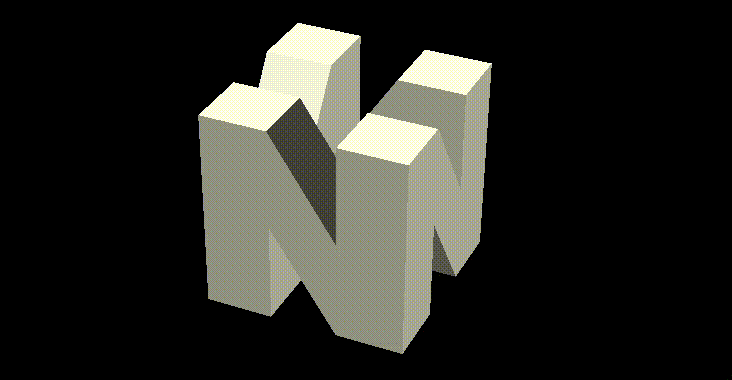

# IME USP OpenSCAD Summer Course

My personal notes and studies.

### Cross pendant

---

### Globo Logo

---

### Plate Ring

---

### Nintendo 64 Logo

---

Links to study

* [working with randomness](https://mathgrrl.com/hacktastic/2019/03/randomizer/)
